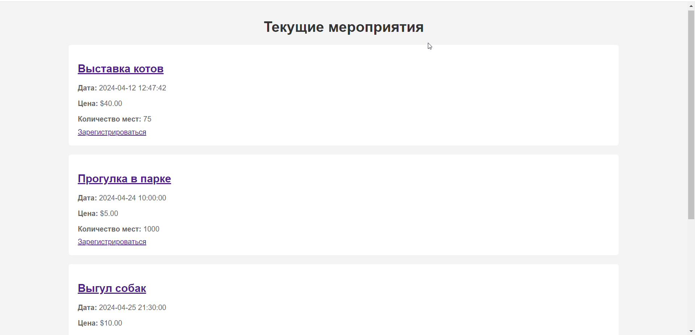
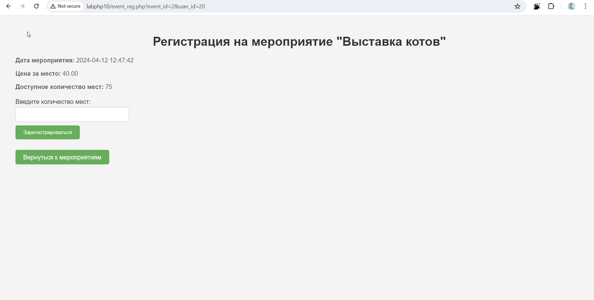
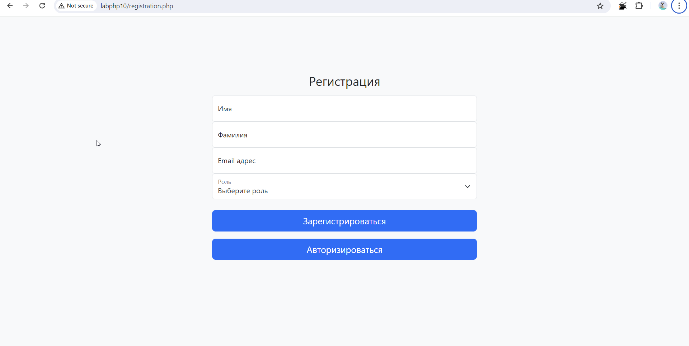
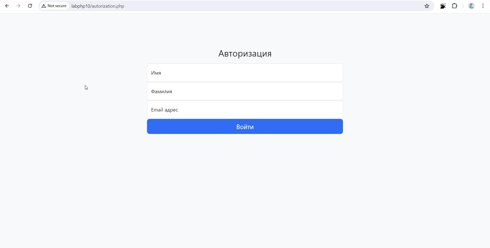
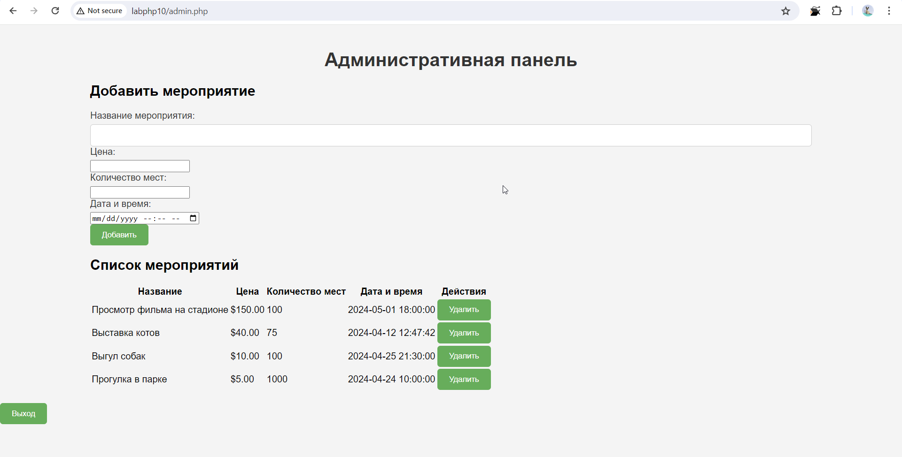

# Лабораторная работа №10 Взаимодействие с базой данных

## Задание:
Разработайте веб-приложение для платформы проведения городских
мероприятий. Платформа будет позволять гражданам узнавать и записываться на
мероприятия.

__Задание 1.__ Создайте базу данных “event_platform”.

__Задание 2.__ Создайте следующие таблицы в базе данных и корректно установите между
ними отношения.

```sql
CREATE TABLE `events` (
  `id` int NOT NULL,
  `name` varchar(255) NOT NULL,
  `price` decimal(10,2) NOT NULL,
  `number_seats` int NOT NULL,
  `date` datetime NOT NULL
) 
```

```sql
CREATE TABLE `event_records` (
  `id` int NOT NULL,
  `user_id` int NOT NULL,
  `event_id` int NOT NULL,
  `seats_requested` int NOT NULL,
  `total_price` decimal(10,2) NOT NULL
) 
```

```sql
CREATE TABLE `User` (
  `id` int NOT NULL,
  `name` varchar(255) NOT NULL,
  `surname` varchar(255) NOT NULL,
  `email` varchar(255) NOT NULL,
  `role_id` text
)
```

```sql
CREATE TABLE `roles` (
  `id` int NOT NULL,
  `name` varchar(255) NOT NULL
) 
```

__Задание 3.__ Внесите изменения в таблицу пользователей, добавив поле role_id,
содержащее идентификатор определенной роли.

```sql
ALTER TABLE User ADD COLUMN role_id INT;
```

__Задание 4.__ Создайте четыре страницы:

— Страница с текущими мероприятиями



— Страница для записи на определенное мероприятие



— Регистрация



— Авторизация



__Задание 5.__ Разработайте административную панель (доступную только пользователю с ID 'manager'), обладающую следующим функционалом:

* Добавление и изменение мероприятия
* Просмотр зарегистрированных на мероприятие.



Задание 6. Сохраняйте все необходимые данные в базе данных.

`event_platfform (1).sql`

## Вывод:

Выполняя данную лабораторную работу я научилась работать с сессиями и базой данных. Было очень сложно, но я спарвилась. 

И я поняла, что больше не хочу добавлять сессии в мою курсовую работу (по совместительству индивидуальную по PHP), но без них и базы данных не интересно. 

"Все, что не убивает, делает нас сильнее."

* Интересный факт:

Фраза взялась от немцев, точнее, от одного немца и в оригинале записывалась как «Was mich nicht umbringt, macht mich stärker» («Что не убивает меня, делает меня сильнее»).
Этот афоризм приписывается немецкому философу Фридриху Ницше. Впервые он был использован им в его книге "Гуманистические чтения" ("Human, All Too Human"), опубликованной в 1878 году. Ницше использовал эту фразу для выражения идеи о том, что переживание трудностей и преодоление испытаний могут укрепить нас и сделать нас более стойкими и сильными.

